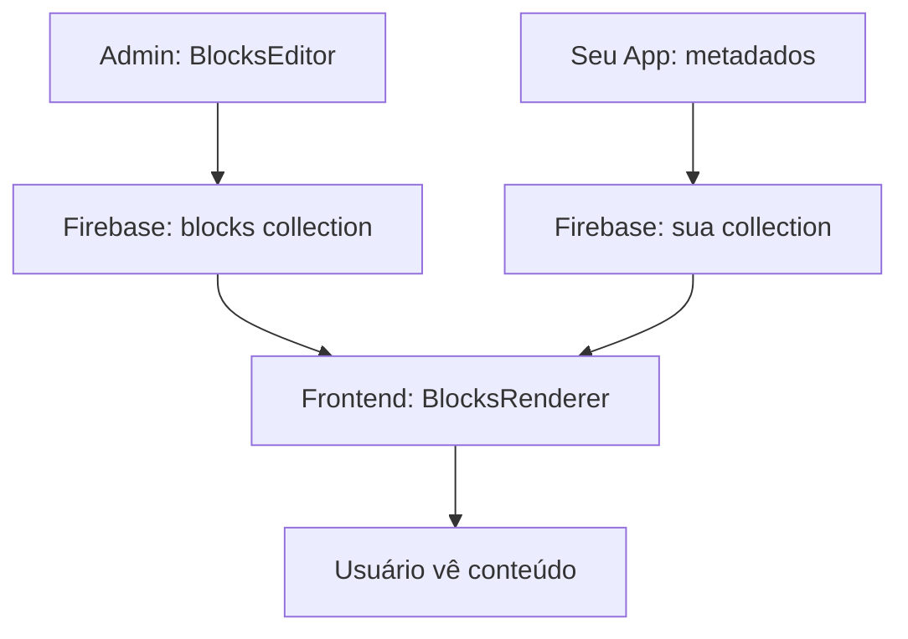

# JovJrx PageBuilder - Documentação Completa

## 🚀 Instalação

```bash
npm install jovjrx-pagebuilder@1.1.0
```

## 📋 Índice

- [Visão Geral](#visão-geral)
- [Configuração Inicial](#configuração-inicial)
- [Modos de Uso](#modos-de-uso)
- [Blocos Disponíveis](#blocos-disponíveis)
- [Estrutura dos Dados](#estrutura-dos-dados)
- [Scripts de Exemplo](#scripts-de-exemplo)
- [API Reference](#api-reference)

---

## 🎯 Visão Geral

O JovJrx PageBuilder oferece **2 modos de operação**:

### 1. **Modo Página Completa** (Page Mode)
- Controla a página inteira (SEO, título, status, blocos)
- Ideal para: Landing pages, páginas institucionais

### 2. **Modo Blocks-Only** ⭐ **NOVO na v1.1.0**
- Controla apenas blocos vinculados a um `parentId`
- Seu projeto controla: SEO, metadados, status
- Ideal para: Produtos, artigos, cursos, qualquer entidade

---

## ⚙️ Configuração Inicial

### 1. Firebase Config
```typescript
// firebase-config.ts
export const firebaseConfig = {
  apiKey: "sua-api-key",
  authDomain: "seu-projeto.firebaseapp.com",
  projectId: "seu-projeto-id",
  storageBucket: "seu-projeto.appspot.com",
  messagingSenderId: "123456789",
  appId: "sua-app-id"
}
```

### 2. Regras do Firestore
```javascript
// firestore.rules
rules_version = '2';
service cloud.firestore {
  match /databases/{database}/documents {
    // Para páginas completas
    match /pages/{pageId} {
      allow read, write: if true; // Ajuste conforme sua autenticação
    }
    
    // Para modo blocks-only
    match /blocks/{blockId} {
      allow read, write: if true; // Ajuste conforme sua autenticação
    }
    
    // Suas outras coleções
    match /products/{productId} {
      allow read, write: if true;
    }
  }
}
```

---

## 🎨 Modos de Uso

### Modo 1: Página Completa
```tsx
import { PageBuilder } from 'jovjrx-pagebuilder'

function EditarPagina({ pageId }: { pageId: string }) {
  return (
    <PageBuilder
      pageId={pageId}
      firebaseConfig={firebaseConfig}
      collection="pages"
      language="pt-BR"
      onSave={(page) => {
        console.log('Página salva:', page.title)
      }}
    />
  )
}
```

### Modo 2: Blocks-Only ⭐
```tsx
import { BlocksEditor } from 'jovjrx-pagebuilder'

function EditarProduto({ produtoId }: { produtoId: string }) {
  return (
    <div className="meu-layout">
      {/* Você controla metadados */}
      <div className="product-meta">
        <h1>Produto: {produtoId}</h1>
        <select name="status">
          <option>rascunho</option>
          <option>publicado</option>
        </select>
      </div>
      
      {/* PageBuilder controla só blocos */}
      <BlocksEditor
        parentId={produtoId}
        firebaseConfig={firebaseConfig}
        collection="product_blocks"
        language="pt-BR"
        
        // Customizações
        hideHeader={true}
        autoSave={true}
        
        onBlocksChange={(blocks) => {
          console.log(`${blocks.length} blocos no produto`)
        }}
      />
    </div>
  )
}
```

---

## 🧱 Blocos Disponíveis

### 1. Hero Block
**Uso:** Seção principal com título, subtítulo e call-to-action
```json
{
  "type": "hero",
  "title": { "pt-BR": "Título Principal" },
  "subtitle": { "pt-BR": "Subtítulo descritivo" },
  "content": [
    {
      "type": "text",
      "variant": "heading",
      "value": { "pt-BR": "Transforme sua ideia em realidade" },
      "order": 0
    },
    {
      "type": "text", 
      "variant": "paragraph",
      "value": { "pt-BR": "Descrição detalhada do produto..." },
      "order": 1
    },
    {
      "type": "actions",
      "primary": {
        "text": { "pt-BR": "Começar Agora" },
        "url": "/signup",
        "action": "link",
        "style": "primary"
      },
      "order": 2
    }
  ]
}
```

### 2. Features Block  
**Uso:** Lista de características/benefícios
```json
{
  "type": "features",
  "title": { "pt-BR": "Características" },
  "content": [
    {
      "type": "list",
      "role": "feature",
      "items": [
        {
          "title": { "pt-BR": "Fácil de Usar" },
          "subtitle": { "pt-BR": "Interface intuitiva" },
          "text": { "pt-BR": "Não precisa ser desenvolvedor..." }
        },
        {
          "title": { "pt-BR": "Rápido" },
          "subtitle": { "pt-BR": "Performance otimizada" },
          "text": { "pt-BR": "Carrega em menos de 2 segundos..." }
        }
      ],
      "order": 0
    }
  ]
}
```

### 3. Text Block
**Uso:** Conteúdo textual puro
```json
{
  "type": "text",
  "title": { "pt-BR": "Sobre Nós" },
  "content": [
    {
      "type": "text",
      "variant": "heading",
      "value": { "pt-BR": "Nossa História" },
      "order": 0
    },
    {
      "type": "text",
      "variant": "paragraph", 
      "value": { "pt-BR": "Fundada em 2020, nossa empresa..." },
      "order": 1
    }
  ]
}
```

### 4. Media Block
**Uso:** Imagens, vídeos, YouTube, Vimeo
```json
{
  "type": "media",
  "title": { "pt-BR": "Demonstração" },
  "content": [
    {
      "type": "media",
      "media": {
        "kind": "youtube",
        "url": "https://youtube.com/watch?v=abc123",
        "alt": "Vídeo demonstração do produto"
      },
      "order": 0
    }
  ]
}
```

### 5. Actions Block
**Uso:** Call-to-actions, botões, preços
```json
{
  "type": "actions", 
  "title": { "pt-BR": "Escolha seu Plano" },
  "content": [
    {
      "type": "actions",
      "primary": {
        "text": { "pt-BR": "Comprar Agora" },
        "url": "/checkout",
        "action": "buy",
        "style": "primary",
        "price": {
          "amount": 99.90,
          "currency": "BRL",
          "original": 199.90
        }
      },
      "secondary": {
        "text": { "pt-BR": "Saiba Mais" },
        "url": "/info",
        "action": "more_info", 
        "style": "outline"
      },
      "order": 0
    }
  ]
}
```

---

## 🗂️ Estrutura dos Dados

### Firebase Collections

#### Modo Página Completa:
```
pages/
├── "landing-home"/
│   ├── id: "landing-home"
│   ├── title: { "pt-BR": "Home" }
│   ├── slug: "landing-home"
│   ├── blocks: [block1, block2, block3...]
│   └── settings: { seo: {...}, status: "published" }
```

#### Modo Blocks-Only:
```
product_blocks/
├── "block_1726834567890_abc"/
│   ├── id: "block_1726834567890_abc"
│   ├── parentId: "produto-123"
│   ├── type: "hero"
│   ├── order: 0
│   └── content: [...]
├── "block_1726834567891_def"/
│   ├── id: "block_1726834567891_def"  
│   ├── parentId: "produto-123"
│   ├── type: "features"
│   ├── order: 1
│   └── content: [...]

products/ (sua coleção)
├── "produto-123"/
│   ├── nome: "Meu Produto"
│   ├── preco: 99.90
│   ├── status: "published"
│   └── seo: {...}
```

### Tipos TypeScript

```typescript
interface Block {
  id?: string
  type: 'hero' | 'features' | 'text' | 'media' | 'actions'
  kind: 'section' | 'component'
  title: MultiLanguageContent
  subtitle?: MultiLanguageContent
  description?: MultiLanguageContent
  content: Content[]
  order: number
  active: boolean
  version: 'draft' | 'published'
  parentId?: string // Para blocks-only mode
}

interface MultiLanguageContent {
  [languageCode: string]: string
  // Exemplo: { "pt-BR": "Olá", "en": "Hello" }
}

type Content = TextContent | MediaContentBlock | ListContent | ActionsContent
```

---

## 🔧 Scripts de Exemplo

### Script 1: Adicionar Bloco Hero
```typescript
import { saveBlockStandalone } from 'jovjrx-pagebuilder/firebase'

async function adicionarHeroBlock(parentId: string) {
  const heroBlock = {
    type: 'hero' as const,
    kind: 'section' as const,
    title: { 'pt-BR': 'Hero Principal' },
    subtitle: { 'pt-BR': 'Subtítulo atrativo' },
    content: [
      {
        type: 'text' as const,
        variant: 'heading' as const,
        value: { 'pt-BR': 'Transforme sua vida hoje' },
        order: 0
      },
      {
        type: 'text' as const,
        variant: 'paragraph' as const, 
        value: { 'pt-BR': 'Descubra como nosso produto pode revolucionar seu dia a dia...' },
        order: 1
      },
      {
        type: 'actions' as const,
        primary: {
          text: { 'pt-BR': 'Começar Agora' },
          url: '/cadastro',
          action: 'link' as const,
          style: 'primary' as const
        },
        order: 2
      }
    ],
    order: 0,
    active: true,
    version: 'draft' as const,
    parentId
  }
  
  const blockId = await saveBlockStandalone(heroBlock, 'product_blocks')
  console.log('Hero block criado:', blockId)
}

// Uso
adicionarHeroBlock('produto-123')
```

### Script 2: Adicionar Bloco Features
```typescript
async function adicionarFeaturesBlock(parentId: string) {
  const featuresBlock = {
    type: 'features' as const,
    kind: 'section' as const,
    title: { 'pt-BR': 'Por que escolher nosso produto?' },
    content: [
      {
        type: 'list' as const,
        role: 'feature' as const,
        items: [
          {
            title: { 'pt-BR': '🚀 Rápido' },
            subtitle: { 'pt-BR': 'Performance otimizada' },
            text: { 'pt-BR': 'Carregamento em menos de 2 segundos' }
          },
          {
            title: { 'pt-BR': '🔒 Seguro' },
            subtitle: { 'pt-BR': 'Dados protegidos' },
            text: { 'pt-BR': 'Criptografia de ponta a ponta' }
          },
          {
            title: { 'pt-BR': '💡 Intuitivo' },
            subtitle: { 'pt-BR': 'Fácil de usar' },
            text: { 'pt-BR': 'Interface pensada para o usuário' }
          }
        ],
        order: 0
      }
    ],
    order: 1,
    active: true, 
    version: 'draft' as const,
    parentId
  }
  
  const blockId = await saveBlockStandalone(featuresBlock, 'product_blocks')
  console.log('Features block criado:', blockId)
}
```

### Script 3: Adicionar Bloco CTA com Preço
```typescript
async function adicionarCTABlock(parentId: string) {
  const ctaBlock = {
    type: 'actions' as const,
    kind: 'section' as const,
    title: { 'pt-BR': 'Oferta Especial' },
    content: [
      {
        type: 'actions' as const,
        primary: {
          text: { 'pt-BR': 'Comprar Agora' },
          url: '/checkout',
          action: 'buy' as const,
          style: 'primary' as const,
          price: {
            amount: 97,
            currency: 'BRL',
            original: 197
          }
        },
        secondary: {
          text: { 'pt-BR': 'Saiba Mais' },
          url: '/detalhes',
          action: 'more_info' as const,
          style: 'outline' as const
        },
        benefits: [
          'pt-BR': '✅ 30 dias de garantia',
          'pt-BR': '✅ Suporte 24/7',
          'pt-BR': '✅ Acesso vitalício'
        ],
        urgency: {
          type: 'limited_time' as const,
          message: { 'pt-BR': '⏰ Oferta válida até amanhã!' }
        },
        order: 0
      }
    ],
    order: 2,
    active: true,
    version: 'draft' as const,
    parentId
  }
  
  const blockId = await saveBlockStandalone(ctaBlock, 'product_blocks')
  console.log('CTA block criado:', blockId)
}
```

### Script 4: Criar Produto Completo
```typescript
async function criarProdutoCompleto(parentId: string) {
  // 1. Hero
  await adicionarHeroBlock(parentId)
  
  // 2. Features  
  await adicionarFeaturesBlock(parentId)
  
  // 3. CTA
  await adicionarCTABlock(parentId)
  
  console.log(`✅ Produto ${parentId} criado com 3 blocos`)
}

// Uso
criarProdutoCompleto('produto-lancamento-2024')
```

---

## 📘 API Reference

### Componentes

#### `<PageBuilder />`
```typescript
interface PageBuilderProps {
  // Modo página completa
  pageId?: string
  
  // Modo blocks-only
  parentId?: string
  mode?: 'page' | 'blocks-only'
  
  // Configuração
  firebaseConfig: FirebaseConfig
  theme?: string | PageBuilderTheme
  language?: string
  availableLanguages?: string[]
  collection?: string
  
  // Callbacks
  onSave?: (page: Page) => void
  onError?: (error: Error) => void
  onLanguageChange?: (language: string) => void
}
```

#### `<BlocksEditor />` ⭐ **Editor**
```typescript
interface BlocksEditorConfig {
  parentId: string
  firebaseConfig: FirebaseConfig
  collection?: string
  language?: string
  availableLanguages?: string[]
  
  // Callbacks
  onBlocksChange?: (blocks: Block[]) => void
  onSave?: (blocks: Block[]) => void
  onError?: (error: Error) => void
  onLanguageChange?: (language: string) => void
  
  // Customizações
  hideHeader?: boolean
  hideSaveButton?: boolean
  hidePreviewButton?: boolean
  hideLanguageSelector?: boolean
  autoSave?: boolean
  customActions?: React.ReactNode
  saveButtonText?: string
  saveButtonColor?: string
}
```

#### `<PageRenderer />` **Visualização**
```typescript
interface PageRendererProps {
  pageId: string
  firebaseConfig: FirebaseConfig
  theme?: string | PageBuilderTheme
  language?: string
  mode?: 'light' | 'dark' | 'auto'
  collection?: string
  
  // Callbacks
  onLoad?: (page: Page) => void
  onError?: (error: Error) => void
}
```

#### `<BlocksRenderer />` ⭐ **Visualização Blocks-Only**
```typescript
interface BlocksRendererConfig {
  parentId: string
  firebaseConfig: FirebaseConfig
  theme?: string | PageBuilderTheme
  language?: string
  mode?: 'light' | 'dark' | 'auto'
  collection?: string
  
  // Callbacks
  onLoad?: (blocks: Block[]) => void
  onError?: (error: Error) => void
}
```

### Funções Firebase

```typescript
// Modo blocks-only
saveBlockStandalone(blockData: Partial<Block>, collection?: string): Promise<string>
loadBlocksByParentId(parentId: string, collection?: string): Promise<Block[]>  
deleteBlockStandalone(blockId: string, collection?: string): Promise<void>
reorderBlocksByParentId(parentId: string, blocks: Block[], collection?: string): Promise<void>

// Modo página completa
savePage(pageId: string, pageData: Partial<Page>, collection?: string): Promise<void>
loadPage(pageId: string, collection?: string): Promise<Page | null>
deletePage(pageId: string, collection?: string): Promise<void>

// Utilitários
generateBlockId(): string
generatePageId(): string
```

---

## � Componentes Disponíveis

| Componente | Propósito | Quando Usar |
|------------|-----------|-------------|
| `<PageBuilder />` | **Editar** páginas completas | Landing pages, páginas institucionais |
| `<BlocksEditor />` | **Editar** blocos independentes | Produtos, artigos, cursos (modo blocks-only) |
| `<PageRenderer />` | **Exibir** páginas completas | Renderizar páginas salvas pelo PageBuilder |
| `<BlocksRenderer />` | **Exibir** blocos independentes | Renderizar blocos salvos pelo BlocksEditor |

### 🔄 Fluxo Completo (Blocks-Only)



---

## �🎯 Exemplos de Uso Prático

### E-commerce: Páginas de Produto

#### **Admin (Edição):**
```tsx
function ProdutoEditor({ produtoId }) {
  return (
    <div className="admin-layout">
      <aside className="sidebar">
        <ProductForm produtoId={produtoId} />
      </aside>
      
      <main className="content">
        <BlocksEditor
          parentId={produtoId}
          collection="product_blocks"
          hideHeader={true}
          autoSave={true}
        />
      </main>
    </div>
  )
}
```

#### **Frontend (Visualização):**
```tsx
function PaginaProduto({ produtoId }) {
  return (
    <div className="product-page">
      {/* SEU header fixo */}
      <header>
        <h1>Meu Produto</h1>
        <nav>Home / Produtos / Item</nav>
      </header>
      
      {/* Conteúdo dinâmico gerenciado pelo PageBuilder */}
      <main>
        <BlocksRenderer
          parentId={produtoId}
          firebaseConfig={firebaseConfig}
          collection="product_blocks"
          language="pt-BR"
          mode="light"
        />
      </main>
      
      {/* SEU footer fixo */}
      <footer>
        <ProdutosRelacionados />
      </footer>
    </div>
  )
}
```

### Blog: Artigos  

#### **Admin (Edição):**
```tsx
function ArtigoEditor({ artigoId }) {
  return (
    <BlocksEditor
      parentId={artigoId}
      collection="article_blocks"
      saveButtonText="📝 Publicar Artigo"
      saveButtonColor="blue"
    />
  )
}
```

#### **Frontend (Blog Post):**
```tsx
function PaginaArtigo({ artigoId }) {
  return (
    <article className="blog-post">
      <header className="article-header">
        <h1>Título do Artigo</h1>
        <div className="article-meta">
          <span>Por: João Silva</span>
          <span>Em: 20/09/2025</span>
        </div>
      </header>
      
      <div className="article-content">
        <BlocksRenderer
          parentId={artigoId}
          collection="article_blocks"
          language="pt-BR"
          mode="light"
        />
      </div>
      
      <footer>
        <ComentariosSection />
      </footer>
    </article>
  )
}
```

### Cursos: Módulos
```tsx
function ModuloEditor({ cursoId, moduloId }) {
  return (
    <BlocksEditor
      parentId={`${cursoId}_${moduloId}`}
      collection="course_blocks"
      onSave={(blocks) => {
        // Marcar módulo como completo
        updateModuleStatus(moduloId, 'completed')
      }}
    />
  )
}
```

---

## 📋 Checklist de Implementação

### ✅ Setup Inicial
- [ ] Instalar `jovjrx-pagebuilder@1.1.0`
- [ ] Configurar Firebase 
- [ ] Definir regras do Firestore
- [ ] Testar conexão

### ✅ Implementação
- [ ] Decidir modo: página completa ou blocks-only
- [ ] Implementar componente no seu projeto
- [ ] Customizar interface conforme necessário  
- [ ] Criar scripts para popular blocos iniciais

### ✅ Deploy
- [ ] Testar em ambiente de desenvolvimento
- [ ] Deploy do Firestore rules
- [ ] Deploy da aplicação
- [ ] Monitorar erros

---

## 🆘 Troubleshooting

### Erro: "Firebase not initialized"
```typescript
// Certifique-se de chamar antes de usar
initializeFirebase(firebaseConfig)
```

### Erro: "Permission denied" 
```javascript
// Verifique suas regras do Firestore
rules_version = '2';
service cloud.firestore {
  match /databases/{database}/documents {
    match /blocks/{blockId} {
      allow read, write: if request.auth != null; // Exemplo
    }
  }
}
```

### Blocos não aparecem
```typescript
// Verifique se o parentId está correto
<BlocksEditor 
  parentId="produto-123" // Deve ser exatamente igual ao salvo
  collection="product_blocks"
/>
```

---

## 🔄 Changelog

### v1.1.0 (Setembro 2025)
- ✨ **NOVO**: Modo blocks-only
- ✨ **NOVO**: Componente `BlocksEditor`
- ✨ **NOVO**: Customizações avançadas (hideHeader, autoSave, etc.)
- 🔧 Funções Firebase para blocos independentes
- 📚 Documentação completa

### v1.0.1 (Setembro 2025)
- 🐛 Compatibilidade com React 19
- 🔧 Removido react-beautiful-dnd
- ✨ Interface de reordenação com botões up/down
- 🎨 Atualização Chakra UI v2

---

## 📞 Suporte

- **GitHub**: [github.com/jovjrx/jovjrx-pagebuilder](https://github.com/jovjrx/jovjrx-pagebuilder)
- **NPM**: [npmjs.com/package/jovjrx-pagebuilder](https://npmjs.com/package/jovjrx-pagebuilder)
- **Issues**: Reporte bugs no GitHub Issues

---

**Desenvolvido com ❤️ por JovJrx**